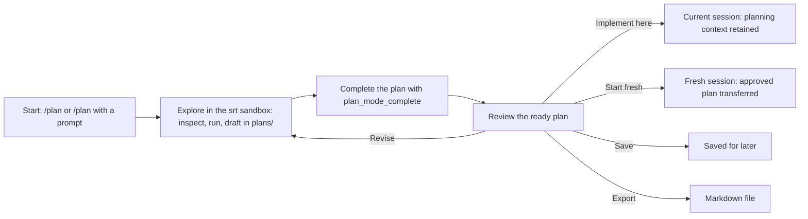
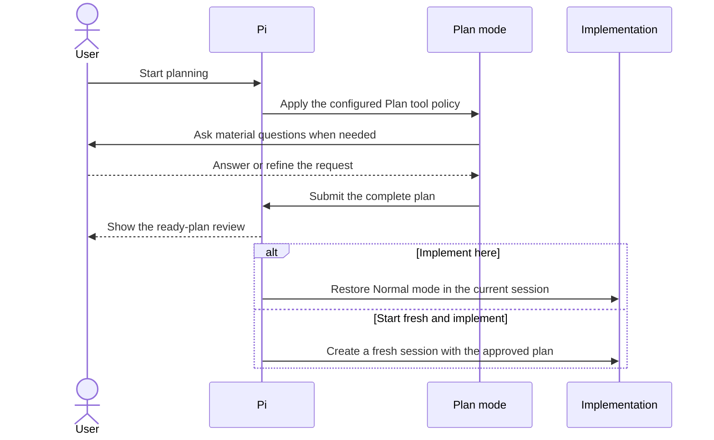

# 🧭 pi-plan-vanguard — Plan in an OS Sandbox Before Pi Edits Code

> **Provenance.** This extension began as a fork of [@narumitw/pi-plan-mode](https://github.com/narumiruna/pi-extensions/tree/main/packages/pi-plan-mode) (MIT) and now evolves independently as **pi-plan-vanguard**.
> It replaces the reviewed shell-command allowlists with **the Anthropic Sandbox Runtime ([srt](https://github.com/anthropics/sandbox-runtime))**: every Plan-mode `bash` call is wrapped in an OS-level sandbox (Seatbelt on macOS, bubblewrap on Linux, srt-win on Windows), so arbitrary exploration — pipes, redirects, subshells, scripts — runs freely while writes stay limited to the plan output directory plus a private per-workflow scratch `TMPDIR`, and the network is deny-by-default. Completed plans persist as Markdown under `plans/` and echo in the TUI.
>
> Install: `pi install git:github.com/hao3039032/pi-plan-vanguard` (remove `npm:@narumitw/pi-plan-mode` first; if you installed the pre-rename `git:github.com/hao3039032/pi-plan-mode`, remove that too). Then install the sandbox: `npm install -g @anthropic-ai/sandbox-runtime` plus its [platform dependencies](#-security-and-privacy).
>
> Sync with upstream: clone `narumiruna/pi-extensions`, re-apply the local commits on top of it, run the plan-mode tests there, then `git subtree split --prefix=packages/pi-plan-mode` and merge the result here. Tests in `test/` rely on the upstream monorepo harness.

[](https://pi.dev) [](./LICENSE)

Use a Codex-like `/plan` mode to explore a codebase inside an OS sandbox, resolve important questions, and approve an implementation-ready plan before Pi edits files.

## ✨ Features

- Starts and manages Plan mode through `/plan`, `/plan start`, or `/plan <prompt>`; `/plan doctor` diagnoses the sandbox.
- Runs every `bash` call inside the srt OS sandbox — no command-text allowlist; blocks mutating tools (built-in `write`/`edit` work only for files inside the plan output directory) and PowerShell (v1 is bash-only) while keeping helper schemas stable.
- Understands Pi 1.0 tool exposure: native MCP and built-in extension tools are auto-admitted when they declare a read-only hint (or explicit opt-in otherwise), and registered codemode/deferred tools may be selected without activation and then run through other tools; every nested call is checked on its own.
- Ships `plan-scout`, a read-only recon subagent registered through pi-subagents, and auto-admits per-call read-only delegation: single-child calls (several per turn for parallel recon, or static `tasks`/`chain` batches where pi-subagents exposes them) to plan-scout, `planAdmittedAgents`, or agents verified read-only via the pi-subagents preflight contract — without host-side parameters (`gate`, `acceptance`, `share`, `worktree`, `cwd`, output paths, …).
- Guides the agent through installing srt and its dependencies when the sandbox is unavailable, and stashes the planning prompt for the recovered start.
- Uses structured questions for important ambiguity and explicit completion for a decision-ready plan.
- Persists completed plans as Markdown in a `plans/` directory (revision-safe filenames) and renders them in the TUI with a path footer; draft updates echo on the tool result.
- Reviews the complete plan before implementation, export, save, further planning, or discard.
- Implements in the planning session or a fresh linked session with the approved plan.
- Configures persistent or one-shot destination model and thinking choices for fresh implementation.
- Restores Plan state and one saved plan across resume and compaction, re-probing the sandbox on restore.
- Configures the Plan tool allowlist, sandbox profile (write paths, deny-read, network domains), plan output directory, export path, plan reinjection, shortcut, and thinking level.
- Publishes statusline state (`plan active (srt)`) and cooperates anonymously with Workflow Mutex Protocol v1 participants.

## 📦 Install

This release requires Pi 0.80.6 or newer.
Native PowerShell tool support requires Pi 0.84.3 or newer on Windows; earlier Pi versions omit that optional tool and retain the existing Plan policy.

```bash
pi install git:github.com/hao3039032/pi-plan-vanguard
```

Try the local checkout without installing permanently:

```bash
pi -e /path/to/pi-plan-vanguard
```

The extension loads `./src/index.ts` directly through Pi's Jiti runtime, so an unbuilt checkout works as-is.

The optional Plan-mode delegation (`plan-scout` and verified read-only agents) needs pi-subagents: `pi install npm:pi-subagents`. Without it, plan-scout cannot register and verified read-only admission is unavailable; `/plan doctor` reports the degraded mode.

Install only from sources you trust because Pi extensions run with Pi's permissions.

## 🚀 Quick start

Run `/plan` to open the state-aware menu, then start Plan mode and ask the agent to inspect and design the change.
Run `/plan <prompt>` when the first planning request is already known.

## 🗺️ How it works

Plan mode keeps exploration and implementation on opposite sides of an explicit review boundary:



During planning, the agent can inspect the project and ask material questions, but Plan mode blocks editing tools outside the plan output directory and sandboxes every shell command. Implementation starts only after the plan is complete and you choose a handoff:



## 💬 Commands

| Command | Purpose |
| --- | --- |
| `/plan` | Start or manage planning, review a plan, or choose same-session or fresh-session implementation. |
| `/plan start` | Probe the srt sandbox, then enter Plan mode without sending a model message; a failing probe injects the setup guide instead of starting. |
| `/plan <prompt>` | Start planning with a prompt (stashed if the sandbox is unavailable), or send a follow-up while already active. |
| `/plan tools` | Choose a session-specific tool policy, then start; cancellation changes nothing. |
| `/plan show` | Render the finished plan (with its document path), the saved/active plan, or the newest draft in the plan output directory. |
| `/plan doctor` | Diagnose the srt sandbox, plan output directory, and effective sandbox profile. |
| `/plan finalize` | Ask the active planner to finish or ask one remaining material question. |
| `/plan implement` | Implement a completed or saved plan in this session, without a selector. |
| `/plan save` | Save a ready plan in this Pi session and leave Plan mode. |
| `/plan settings` | Open the same Plan Settings screen available from the menus. |
| `/plan export [path]` | Write a ready, saved, or active implementation plan to an explicit Markdown target (finished plans are already persisted under `plans/`). |
| `/plan exit` (alias: `off`) | Leave Plan mode and discard its ready plan, or clear a saved/active plan. |

All routes support TUI and RPC.
Print and JSON modes reject the menu, `tools`, and `settings`; stored-plan display and implementation have [additional mode restrictions](#-planning-and-implementation).
Exact subcommand words select routes; other text is a planning prompt, so `/plan start a migration` sends a prompt rather than rejecting trailing text.
There is no startup flag.

State-changing transitions require an idle run; tool selection is locked once planning starts.
`show`, `save`, `export`, and `implement` require an applicable stored plan; `finalize` requires active Plan mode.
Export defaults to the configured destination (`PLAN.md` when unset), never overwrites an existing target, and ends Plan mode only when exporting a ready plan.
See [command workflows](./docs/command-workflows.md) for tool selection, busy-state recovery, path handling, and export cancellation, and [Security and privacy](#-security-and-privacy) before allowing custom tools.

## 🔒 Security and privacy

Plan-mode exploration is enforced by the **Anthropic Sandbox Runtime ([srt](https://github.com/anthropics/sandbox-runtime))**, an OS-level sandbox — the same layer Claude Code uses — rather than by command-text allowlists:

- **Filesystem**: reads are allowed everywhere except denied secret paths (`~/.ssh`, `~/.aws`, `~/.gnupg`, `~/.config/gcloud`, `~/.netrc`, `**/.env`, `**/.env.*`, plus your `planSandbox.denyRead` entries); writes are allowed only in the plan output directory (created at Plan start if missing) and a private per-workflow scratch directory exported to commands as `TMPDIR` (`planSandbox.allowWrite` adds more). `/tmp` itself is read-only. The srt profile files live in `<agent dir>/srt` (mode 0700, files 0600); the whole pi agent directory and the pi-plan-vanguard settings files (including every legacy filename still holding a configuration) are always in the profile's `denyWrite` — which takes precedence over `allowWrite` — so a sandboxed command can never rewrite its own sandbox, even with a widened `allowWrite`. The scratch directory and profile are removed when the workflow ends.
- **Network**: denied for every domain by default; allow specific hosts with `planSandbox.allowedDomains` (wildcards like `*.npmjs.org`).
- **Shell**: every `bash` call is rewritten to `CLAUDE_CODE_TMPDIR='<scratch>' srt -s <profile> -c '<command>'` in the `tool_call` hook (srt hands `CLAUDE_CODE_TMPDIR` to the command as `TMPDIR`) — pipes, redirects, subshells, variables, and arbitrary commands all run inside the sandbox. `EPERM`/`Operation not permitted`/proxy denials are the boundary; annotated results tell the agent not to retry with different syntax.
- **Tools**: built-in `write` and `edit` are allowed only when active and only for targets that resolve (after `..` normalization and symlink resolution) inside the plan output directory — everything else, extension tools that override those names, other unknown built-ins, and `powershell` stay blocked (v1 sandboxes the `bash` tool only); in-process readers (`read`, `grep`, `find`, `ls`) stay allowed; explicitly selected non-built-in tools run at user risk, as upstream.
- **Delegation**: `subagent` calls are admitted per call only when every referenced agent is provably safe — the built-in `plan-scout` (registered with `read`/`grep`/`find`/`ls` only), names you list in `planAdmittedAgents`, or agents whose pi-subagents preflight contract shows an explicit, entirely read-only tool allowlist with no child extensions and whose definition file carries no runner/machine/acceptance/extension directives or output escapes. The call itself must be a single child or a static `tasks`/`chain` batch (pi-subagents exposes top-level `tasks`/`chain` only when its `disabledFeatures` includes `workflow-scripts`; otherwise parallel recon is several single-child calls in one turn), and `action: "list"` agent listings are fine too; the host-side parameters — `gate`, `acceptance` (other than `false`), `share`, `worktree`, `isolation`, `sessionDir`, `machine`, `cwd`, and output paths — are exactly the ones that deny the exemption, because they execute in the Pi host process instead of the read-only child. Workflow scripts are never admitted unless you enable `planAdmitWorkflowScripts` (full trust: a script can spawn any agent and carry host-side gates and outputs). A name collision between `plan-scout` and a configured agent disables the registration (shown by `/plan doctor`) rather than breaking pi-subagents.

**There is deliberately no allowlist fallback.** If the sandbox is unavailable, Plan start fails closed: the extension injects an agent-facing setup guide with the exact diagnosis and install commands (the agent must get your approval before installing), and `/plan <prompt>` stashes your prompt for the next successful start. Resumed workflows re-probe and leave Plan mode with the same guide when the sandbox is gone. Run `/plan doctor` for a human-readable check.

**Platform requirements** (from srt):

| Platform | Mechanism | Requirements |
| --- | --- | --- |
| macOS | Seatbelt (`sandbox-exec`) | `brew install ripgrep`; then `npm i -g @anthropic-ai/sandbox-runtime` |
| Linux | bubblewrap + network namespace | `sudo pacman -S --needed bubblewrap socat ripgrep` (Arch), `sudo apt-get install -y …` (Debian/Ubuntu), `sudo dnf install -y …` (Fedora), `sudo zypper install -y …` (openSUSE); the setup guide detects the package manager on `PATH`. Ubuntu 24.04+ may need `sudo sysctl -w kernel.apparmor_restrict_unprivileged_userns=0` |
| Windows (alpha) | srt-win + WFP | one-time elevated `npx @anthropic-ai/sandbox-runtime windows-install`; PowerShell remains blocked in v1 |

Set `PI_PLAN_MODE_SRT_PATH` to use a non-PATH srt binary.
While Plan mode is active, it also instructs the agent not to edit files or implement the change, and another active-tool policy hiding `plan_mode_question`/`plan_mode_complete` still fails Plan start without widening that policy.

**Plan documents.** The plan output directory (default `plans/`, configurable via `planOutputDir`) is created at Plan start if missing and is sandbox-writable: the agent may draft and iterate Markdown there from the shell or with the built-in `write`/`edit` tools — a successful `write`/`edit` of a Markdown file there, or a Plan-mode `bash` call after which a top-level Markdown file in the directory is newer than the call (subdirectories are not scanned), annotates the tool result with `📄 Plan draft updated → <path>` — while every accepted `plan_mode_complete` plan is persisted by the extension as `plans/YYYY-MM-DD-<slug>.md` — revisions overwrite the same file, new workflows create a new one. The TUI renders the finished plan with a `📄 <path>` footer, the ready-plan menu lists the same path, and `/plan show` renders the draft or finished document on demand. Track `plans/` in git (or ignore it) as you prefer.

## 🧭 Planning and implementation

`plan_mode_question` follows Codex's `request_user_input` pattern: the agent can ask 1-3 concise questions, each with meaningful options and a free-form Other path.
In TUI mode, a single question shows its header as plain muted text, submits as soon as its preset or custom answer is confirmed, and does not show tabs, Review, or question-navigation controls.
Add an optional note with `n` before confirming a single preset answer.
With two or three questions, one question appears at a time with question tabs and a final Review tab.
Use Tab, Shift+Tab, left, or right to visit any question or Review, including unanswered future questions.
Use up and down to choose an option, Enter to record it and advance, or `n` to record the highlighted option and open its optional note editor.
Press `n` again on an answered item to edit or clear its note.
Revisit a question to replace its answer; changing the chosen option clears its prior note.
Review lists every answer and note, blocks incomplete submission, and requires returning to a question to edit its answer or note.
Custom answers and notes retain their raw submitted text in the tool result, while terminal rendering is sanitized.
The TUI rejects either field above 4,000 characters instead of truncating it.
RPC keeps the existing sequential `select` and `editor` dialogs because Pi RPC cannot render custom TUI components.
If you cancel or no interactive UI is available, the agent should ask a concise plain-text question or proceed only with a clearly stated low-risk assumption instead of prematurely producing a final plan.

Pi identifies tools by tool name.
The pre-start selector stores accepted session policy names and shows each effective tool's source from Pi metadata, such as `built-in`, a user extension path, or a project extension path.
A selected name can run in Plan mode only when Pi has registered and activated the effective selectable tool by that workflow's first provider-bound context.
The allowlist freezes at that boundary, so a tool registered or activated later waits for the next Plan workflow.
If an extension overrides a built-in tool with the same name, Pi exposes the effective tool for that name and the selector shows that source.

A complete Plan mode answer should appear only after the agent has resolved discoverable facts and high-impact user decisions.
The agent must call `plan_mode_complete({ plan })` alone as its final action, passing the complete Markdown plan.
The tool rejects empty or whitespace-only plans and plans longer than 50,000 JavaScript characters; it does not truncate.
Its visible result contains the full plan, and versioned result details let the extension restore it safely from the active session branch.

`plan_mode_complete` uses Pi's `terminate: true` hint.
Termination is best effort: if a model puts it in a parallel tool batch, Pi terminates the batch early only when every finalized sibling tool also terminates.
The prompt therefore requires the completion call to be standalone and last.
The extension deliberately does not infer completion from phrases such as “I will present the plan,” and ordinary research or clarification turns never trigger automatic retries.
`/plan finalize` and its exact canonical finalization prompt are explicit recovery requests.
If one of those requests ends normally without a valid structured question or completed plan, Plan mode waits for `agent_settled` and retries once with stronger tool guidance.
A valid question, accepted completion, user cancellation, explicit exit, workflow supersession, reload, session replacement, or shutdown cancels the retry.
A second prose-only failure leaves Plan mode active, warns in interactive modes, and requires another explicit `/plan finalize` request.

Legacy sessions and models may still submit one non-empty `<proposed_plan>` block with tags on their own lines.
That compatibility path remains accepted, but it is not the primary workflow.
Empty, malformed, unclosed, or multiple legacy blocks keep Plan mode active and produce a warning.

After completion, `/plan` opens the ready actions when interactive UI is available.
The same flat menu shows **Implement here** and **Start fresh and implement**, explains which conversation context each choice uses, and previews the selected **Plan reinjection** policy.
**Implement here**—and the compatibility route `/plan implement`—appends the Normal contract, lifts the Plan runtime policy, captures the reinjection setting, and starts implementation in the current session with its complete planning conversation and tool calls.
**Start fresh and implement** opens a settings page before replacement.
Its searchable model list snapshots the session's scoped models when configured, otherwise Pi's currently available models, and shows each provider, model ID, and friendly name.
Pi 0.80.6–0.82.1 does not expose session model scopes to extensions, so the list uses all currently available models on those releases.
One-shot provider and model identifiers are limited to 512 characters each; longer custom identifiers are rejected before the source session is replaced.
The model and thinking rows start from the persistent **Fresh model** and **Fresh thinking** defaults; when either setting is omitted, they show the planning session's current value with **same as plan** and carry it into the fresh session independently.
The fixed thinking choices are `off`, `minimal`, `low`, `medium`, `high`, `xhigh`, and `max`.
Back navigation preserves this menu-local draft, while closing and reopening the menu restores both persistent defaults.
If the configured model is outside the current scope or no longer available, the row reports the fallback and uses **same as plan** without deleting the stored preference.
The saved-plan menu keeps its direct fresh-session action without optional rows and applies the same persistent defaults and fallback.

Starting from that settings page waits for the source session to become idle, re-resolves and authenticates an explicit model, creates a new session linked to the persisted source as its parent, and transfers the exact approved plan without copying planning messages, tool results, or compaction/branch summaries.
The destination consumes the one-shot choices before its first provider request, applies an explicit model first, and then applies explicit thinking.
Concurrent prompts that arrive while those choices are being applied are queued as follow-ups behind the kickoff prompt.
If durable consumption blocks the kickoff, the handoff reports a partial start and restores a conversation-history prompt to the editor instead of reporting success.
Changing only the model keeps the planning thinking level; changing only the thinking level keeps the planning model.
If Pi clamps an unsupported thinking level, the extension reports the effective level.
If the chosen model disappears or loses authentication after source preflight, the destination reports the race, consumes the intent without retrying it later, and continues with its default model.
The destination still loads its normal `AGENTS.md`, skills, project resources, and extensions.
Choosing **Export plan…** asks for a destination, writes the plan, appends the Normal contract, restores inherited thinking, and leaves Plan mode without starting a model turn or changing active tools.
Choosing **Save for later**—or running `/plan save`—instead stores one plan in the current Pi session before leaving Plan mode.

When a resumed active Plan workflow completes before `/plan` has run in that resumed session, the automatic menu cannot obtain Pi's command-only session replacement capability; choosing fresh asks you to reopen `/plan`, where the same action is available.
A successful fresh handoff does not delete or consume the source planning session.
Resume it later to inspect or hand off the ready/saved plan again; this deliberate duplication is the recovery path if the destination work is abandoned.
In-memory sessions create an unlinked fresh session because no parent file exists.
Escape, Ctrl+C, menu disposal, source replacement/shutdown, model/auth failure, or cancellation by another extension before replacement leaves the source plan unchanged.
Under **Off — conversation history only**, the destination receives the complete plan in its initial user prompt and does not persist active-plan state.
When a one-shot runtime choice exists, only that temporary non-model state is persisted and it is removed before the first request.
If that removal cannot be persisted, the request is not sent and can be retried after session persistence is available.
If that kickoff fails, the complete request remains in the destination editor and the source remains resumable.
Under either guaranteed-plan policy, the destination persists active-plan state before kickoff.
If guaranteed-plan persistence fails, the complete request is placed in the destination editor and the source remains resumable.
If a guaranteed-plan kickoff fails, the destination retains the active plan; send a message to continue, use `/plan exit` to clear it, or resume the parent planning session.

A saved plan appears as `plan saved` and remains available after reload, resume, branch-local fork, and compaction in that session.
It does not expire automatically, cross into a new session, or participate in ordinary model context.
Open `/plan` to Show, Implement here, Start fresh and implement, Export, open Settings, or Clear it; `/plan show`, `/plan implement`, `/plan export [path]`, and `/plan exit`/`off` retain their direct routes in TUI and RPC.
Fresh implementation checks idle state, the selected model, and authentication before session replacement; Implement here keeps its established preflight behavior.
Starting another workflow with `/plan start`, `/plan <prompt>`, or `/plan tools` is blocked until the saved plan is implemented or cleared, so the single saved slot is never silently overwritten.
Resuming that session keeps the plan saved; open `/plan` to review, implement, export, or clear it.
Cancellation or failed implementation preflight leaves it unchanged.

Text print and JSON modes cannot display the bare `/plan` menu and reject that route before changing state; use `/plan start` for direct no-prompt activation or `/plan <prompt>` to start planning with a prompt.
`/plan tools` also rejects before changing state because its staged selector requires TUI or RPC.
These modes can export any stored plan with `/plan export [path]`, save a ready plan with `/plan save`, and clear it with `/plan exit` or `/plan off`.
Successful export is observable through the created file; exporting a ready plan also leaves Plan mode, while saved and active implementation state remains unchanged.
An existing target or missing plan fails the command without changing state.
These modes reject saved-plan display and implementation before changing state because Pi provides neither printable custom-message output nor acknowledged extension-triggered turns; resume the session in TUI or RPC to show or implement it.

Both implementation paths apply the current **Plan reinjection** policy in their destination.
The default **Off — conversation history only** policy does not create active-plan state or inject a hidden plan context.
Implement here sends `Implement the plan.` and leaves the accepted plan in ordinary planning history.
Start fresh and implement, or implementing a saved plan here, puts the complete plan in one ordinary initial user prompt because no reliable planning conversation is present.
Later model calls then rely on Pi's normal conversation history and compaction behavior.
**Through first implementation run** guarantees the exact plan throughout that run, including retries, compaction retries, and queued continuation, then clears active-plan state at `agent_settled`.
**Until manually cleared** guarantees the exact plan across later turns, resume, and manual or automatic compaction until `/plan exit` or supersession.
The guaranteed policies avoid a duplicate context block while the original implementation handoff remains available and inject one hidden canonical copy after that handoff is compacted away.
Reinjection can consume up to the existing 50,000-character plan limit in model context.
Cleanup is bound to the matching implementation, so an older run settling cannot clear a newer handoff.

While a guaranteed plan is active, `/plan show` displays the accepted plan.
Interactive `/plan` offers Show, Export plan…, Settings, Start a new plan, and Clear; `/plan exit` and `/plan off` are the direct clear routes.
Settings changes never alter the policy already captured by an active guaranteed-plan implementation.
Automatic first-run cleanup removes the active status and future injected context after the triggering implementation run has received the complete plan.
Starting a new Plan-mode workflow or implementing a replacement plan supersedes an active guaranteed plan.
The extension deliberately does not infer completion from assistant prose or agent settlement under **Until manually cleared**, so clear the active plan when it no longer applies.
Under **Off — conversation history only**, implementation messages remain ordinary conversation history and there is no active plan for `/plan exit` to remove.
Choosing Stay before implementation keeps the plan ready.
Revision feedback starts another Plan-mode turn and clears the previous implementable plan until an updated completion arrives.
For clarification-only follow-ups, the agent answers and resubmits the complete unchanged plan so it remains implementable.
Before saving or implementation, exit/off discards the ready plan and removes its completion result from later non-Plan model context.

While Plan mode is enabled, the extension also publishes a compact status for Pi statuslines.
With `@narumitw/pi-statusline`, this appears in the extension status area:

- `plan active`: Plan mode is enabled and still gathering context or drafting a plan.
- `plan ready`: A completed plan is stored until you implement it, export it, save it, continue planning, or exit Plan mode.
- `plan saved`: One completed plan is stored outside model context in the current session until you implement or clear it.
- `plan implementing`: The exact accepted plan is guaranteed under **Through first implementation run** or **Until manually cleared**.

You can also exit directly.
Before implementation, direct exit discards the latest proposed plan; while a plan is saved, it clears that saved plan.
During a guaranteed-plan implementation, it removes both the original implementation handoff and the extension's canonical active-plan block from later model calls; an earlier Pi-generated compaction summary may still describe prior work:

```text
/plan exit
```

## 🧱 Cache-stable mode transitions

Plan and Normal requests share one append-only conversation.
The extension appends one hidden, model-visible, versioned Plan contract before the first Plan prompt and one Normal contract before the first post-Plan Normal or implementation prompt.
Ordinary linear turns do not rewrite or duplicate these contracts.
**Implement here** retains the Plan dialogue, structured questions, tool calls, completion evidence, and `Implement the plan.` kickoff in order.
**Start fresh and implement** is the isolation path and transfers only the approved plan plus the Normal contract to a linked session.

The `context` hook filters repeated legacy `plan-mode-context` artifacts but preserves current transition messages.
If compaction removes the effective transition, the hook inserts one canonical fallback at a deterministic retained-history boundary.
Repeated transforms leave that fallback in place instead of moving it to the newest turn.
An inactive legacy state entry does not inject a Normal contract, so sessions that never entered Plan mode keep their ordinary context after resume or reload.
Manual `/tree` navigation restores branch-owned Plan state and chooses the matching contract without navigating or adding a branch summary.
Pi lists hidden transition messages in `/tree`; Plan mode rejects those internal targets, so select an adjacent conversation entry.

Plan mode registers `plan_mode_question` and `plan_mode_complete` once and keeps their names and definitions stable across Normal, Plan, ready, implementation, and restored workflows.
Visible helpers do not mean `/plan` is active, and their descriptions exclude ordinary planning, the `writing-plans` skill, roadmaps, checklists, and plan-file work.
Only the latest active Plan contract authorizes the helpers; inactive or stale calls fail without accepting a plan or opening question UI.
Plan mode does not widen a restrictive active-tool policy; start or restore fails when a required helper is unavailable.
Stable schemas preserve a cache-eligible prefix but cannot guarantee a hit because provider serialization, cache lifetime, minimum prefix size, implementation details, and session affinity remain external.

The default `thinkingLevel: "inherit"` avoids a Plan-specific reasoning-parameter change.
A fixed Plan thinking level remains supported, but changing reasoning parameters can prevent provider-side state reuse even when prompts and tool schemas stay stable.

## 🤝 Workflow coexistence

Plan mode is independently installable and keeps its standalone behavior when no other protocol participant is present.
On the characterized Pi `0.84.2` runtime, it participates in the anonymous `workflow:mutex:v1` `agent-workflow` group.
It holds the group while Planning is active, while a completed plan awaits review, and while revision is underway.
Saved plans and ordinary implementation after Plan handoff do not hold the group.

Every inactive start performs one final synchronous admission after asynchronous preflight and before changing Plan state, persistence, prompts, tools, thinking level, queues, or status.
If another participant is active, TUI and RPC show an anonymous warning that another workflow is active.
Print and JSON direct routes throw the same anonymous error before mutation.

Launch-menu, selected-tool, shortcut, active-implementation **Start a new plan**, and restored activation use the same admission boundary.
A rejected selected-tool launch does not save its draft choices.

Restored active Plan state acquires before restoring restrictive tools, thinking, status, or model hooks.
If restoration is busy, Plan mode stays non-running, leaves persisted history and active tools untouched, and requires a later reload or explicit new start after the other workflow ends.
Planning-session cancellation during a fresh implementation preflight keeps the source Plan and its ownership.
Successful session replacement relies on source-session shutdown to clean up and release; the destination's ordinary active implementation does not acquire the Plan mutex.

The coexistence guarantee is cooperative and applies only when every contender implements v1 on the characterized Pi runtime and shares its event bus and session-manager identity.
A pre-v1, mixed-version, non-participating, forked, or otherwise uncharacterized counterpart remains unsupported for mutual exclusion.
Plan mode does not identify, inspect, configure, start, stop, or depend on another extension.
Guaranteed coexistence with Goal requires `@narumitw/pi-goal` `0.53.0` or newer and this package at `0.52.0` or newer on the characterized Pi `0.84.2` runtime.

| Installation | Support |
| --- | --- |
| Plan mode without another workflow participant | Supported standalone behavior |
| Plan mode `>=0.52.0` with Goal `>=0.53.0` on Pi `0.84.2` | Workflow Mutex v1 coexistence guarantee |
| Either package below its floor, or another Pi runtime | Standalone behavior only; mutual exclusion unsupported |

## 🛠️ Tools

- `plan_mode_question` asks up to three structured questions, supports optional answer notes, submits one answer directly, and reviews multiple answers before TUI submission.
- `plan_mode_complete` records the complete approved Markdown plan and terminates the planning turn when called alone.
- Other tools follow the Plan policy: the classic built-ins (`read`/`grep`/`find`/`ls` read-only, `bash` sandboxed, `edit`/`write`/`powershell` blocked), while extension and MCP tools are auto-admitted when their `readOnlyHint` annotation marks them non-mutating and require explicit selection otherwise. Codemode/deferred tools can be selected before activation and run through other tools; direct and model-only tools must be active to be called.

## ⚙️ Settings

Run `/plan settings`, open **Settings** from an inactive `/plan` menu, or edit `<getAgentDir()>/pi-plan-vanguard.json` (normally `~/.pi/agent/pi-plan-vanguard.json`).
The optional file is read at session start and watched for changes; only an explicit save creates it.
Earlier filenames — `pi-plan-mode.json` and `plan-mode.json` — remain readable legacy files (newest wins); the first explicit Settings save writes the new canonical file from the complete legacy document and never modifies the old one.

```json
{
  "thinkingLevel": "inherit",
  "implementationPlanRetention": "clear-on-start",
  "defaultImplementationModel": {
    "provider": "anthropic",
    "modelId": "claude-sonnet-4-5"
  },
  "defaultImplementationThinkingLevel": "high",
  "defaultPlanExportPath": "PLAN.md",
  "planOutputDir": "plans",
  "planAdmittedAgents": ["researcher"],
  "planAdmitWorkflowScripts": false,
  "planSandbox": {
    "allowWrite": ["/absolute/path/to/extra-cache"],
    "denyRead": ["~/.ssh", "**/.env"],
    "allowedDomains": []
  }
}
```

By default, Plan mode inherits thinking, allows active safe built-ins, uses the planning model and thinking level for fresh implementation, exports explicit copies to `PLAN.md`, and relies on ordinary conversation history after implementation starts.
`planAdmittedAgents` (optional list) names subagents that Plan-mode delegation calls may run without per-agent verification, and `planAdmitWorkflowScripts` (default `false`) admits `workflow: true` script delegation with full trust — a script can spawn any agent and carry host-side `gate`/`output` effects, so leave it off unless you accept that.
`planOutputDir` (default `plans`) is where accepted plans are persisted and made sandbox-writable (Plan start creates it if missing; a relative value must be a real, non-symlinked directory inside the working directory, and the resolved directory is frozen for the whole workflow); `planSandbox` extends the built-in profile — the plan output directory and the private scratch `TMPDIR` are always writable, the srt profile directory and the pi-plan-vanguard settings files are always write-denied, and the built-in secret deny-read list always applies.
The shortcut is disabled unless configured; enabling, changing, or removing it takes effect after `/reload` or restarting Pi.
Until then, the current shortcut binding stays unchanged.
Settings saves apply to later workflows; an active implementation keeps its captured reinjection policy.
The export destination affects the next export immediately.

> [!WARNING]
> `planSandbox.allowWrite` widens what sandboxed shell commands may write during planning. Every entry is an OS-enforced writable path for arbitrary commands; list only directories you are comfortable letting an agent write to while planning.
> `planSandbox.allowedDomains` opens real network access from the sandbox; keep it empty for fully offline planning.

Saves are ordered within one Pi process, preserve unknown fields, and publish atomically; separate Pi processes can still race.
Invalid settings remain untouched and make Settings read-only; session-start failures use safe defaults.

Read the [settings reference](./docs/settings.md) for all accepted values, tool-policy resolution, reinjection choices, shortcut configuration, sandbox-profile examples, and legacy-file migration.

**Breaking changes vs upstream** (this fork): the reviewed bash/PowerShell command allowlists and the `safeSubcommands` setting are removed; srt is a hard requirement for Plan workflows; `powershell` is blocked during Plan mode (v1 covers `bash`); completed plans are additionally persisted under `plans/`.

## 🧠 Codex-like behavior

This extension maps Codex's `ModeKind::Plan` behavior onto Pi's extension API:

- Plan mode is conversational collaboration, not TODO or progress tracking.
- `/plan <prompt>` enters Plan mode before submitting the prompt.
- The agent uses `plan_mode_question` for material preferences and completes with a standalone `plan_mode_complete` call instead of prose detection.
- The default `clear-on-start` policy uses conversation history; `clear-after-first-run` and `keep` add exact-plan guarantees.
- Append-only Plan and Normal contracts keep helper schemas stable; unlike Codex, exploration is enforced by an OS sandbox (srt) rather than by command-text policy.

## 🗂️ Package layout

```text
packages/pi-plan-mode/
├── src/                               # Policy, questions, settings, and handoff modules
│   ├── index.ts                       # Thin Pi entrypoint
│   └── plan-mode.ts                   # Planning policy and implementation handoff
├── dist/                              # Generated Jiti runtime
├── scripts/build-runtime.mjs          # Runtime builder
├── docs/                              # Published reference documentation
└── test/                              # Behavior and lifecycle coverage
```

The generated runtime is built from `src/index.ts` and does not import back into `src`.

## 🔎 Keywords

Pi extension, Pi coding agent, plan mode, Codex-like plan mode, AI coding workflow, read-only planning, implementation plan.

## 📄 License

MIT.
See [`LICENSE`](./LICENSE).
